# 🏋️ VitaFit — AI Fitness Tracker

<p align="center">
  <strong>AI-powered Android fitness tracking and wellness companion built with Java, Firebase, and Firebase AI Logic.</strong>
</p>

<p align="center">
  <a href="https://github.com/Ashutosh9-pan/VitaFit-AI-Fitness-Tracker">
    
  </a>
  
  
  
</p>

> **VitaFit provides general fitness and wellness guidance. It is not a substitute for professional medical advice.**

## ✨ Overview

VitaFit is a modern Android fitness tracker designed to combine **workout logging, progress analytics, reminders, profile management, and AI-assisted wellness tools** in one mobile application.

The app includes a dedicated **AI Fitness Assistant hub** with multiple tools for recommendations, coaching, meal planning, workout planning, and progress analysis.

## 🚀 Key Features

### 🏃 Fitness Tracking
- Personalized dashboard with workout summaries
- Add, search, review, and delete workout records
- Fitness statistics and progress visualization
- Workout history export as **PDF or CSV**
- Share generated workout reports

### 🤖 AI Fitness Assistant
- **Smart Recommendation** — profile-aware general fitness suggestions
- **AI Coach Chat** — conversational guidance using saved profile and activity
- **Balanced Diet Planner** — meal suggestions based on user preferences
- **AI Workout Planner** — structured workout suggestions based on selected preferences
- **AI Progress Analyzer** — reviews saved workout activity and consistency

### 🔐 Security & Account
- Secure email/password authentication
- Email verification
- Firebase App Check with **Play Integrity**
- Sensitive configuration files excluded from the repository

### 🎨 User Experience
- Light and dark themes
- Responsive bottom navigation
- Navigation drawer
- Workout reminders with reboot restoration
- Mobile-friendly AI response formatting

## 🛠️ Tech Stack

| Area | Technology |
|---|---|
| Language | **Java 17** |
| Platform | **Android SDK** |
| UI | XML, Material Components, ConstraintLayout, RecyclerView |
| Authentication | Firebase Authentication |
| Database | Firebase Realtime Database |
| Generative AI | Firebase AI Logic |
| App Protection | Firebase App Check + Play Integrity |
| Charts | MPAndroidChart |
| Async Utilities | Guava ListenableFuture |
| Build System | Gradle Kotlin DSL |

## 📱 Screenshots

<p align="center">
  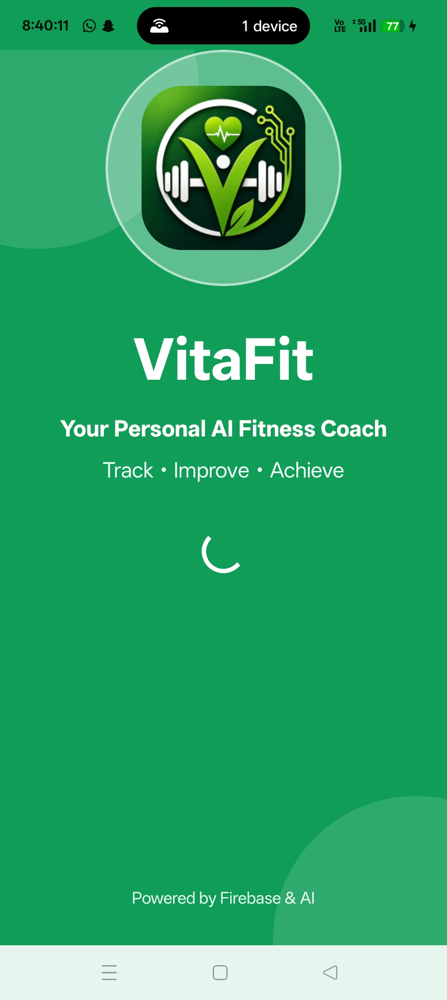
  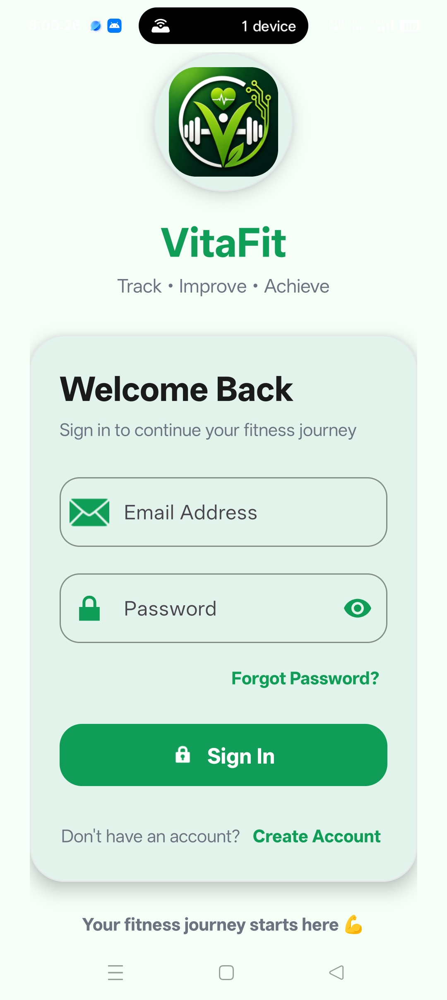
  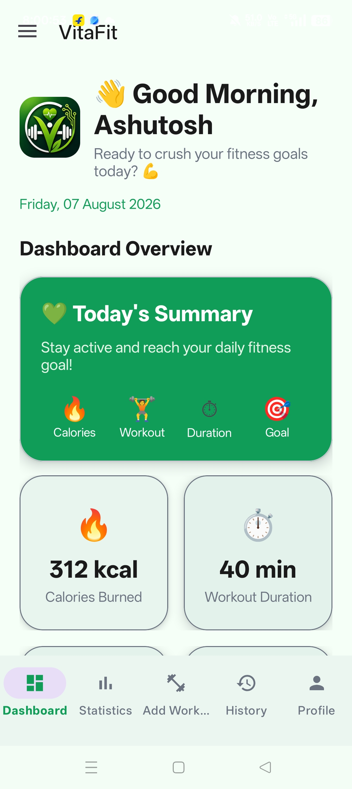
</p>

<p align="center">
  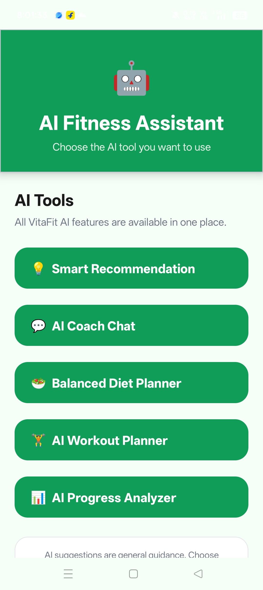
  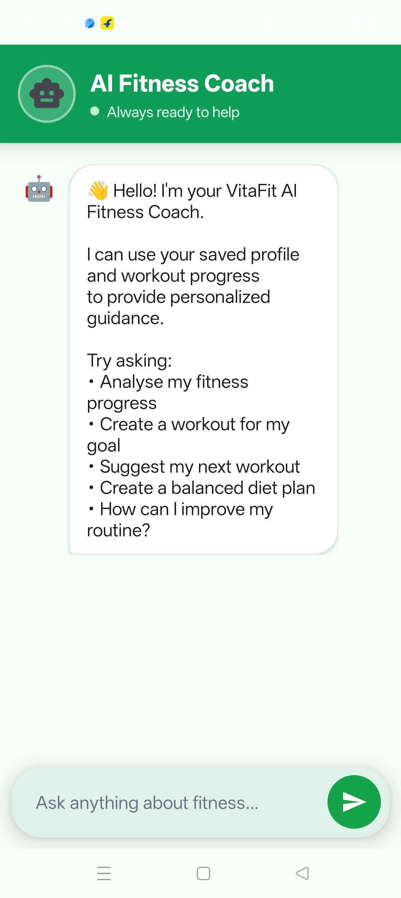
  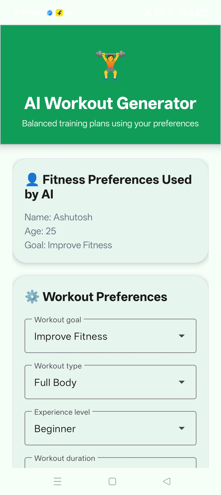
</p>

<p align="center">
  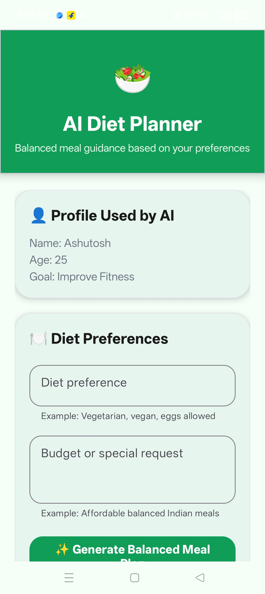
  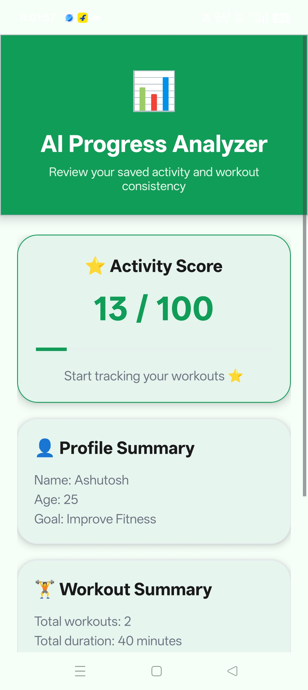
  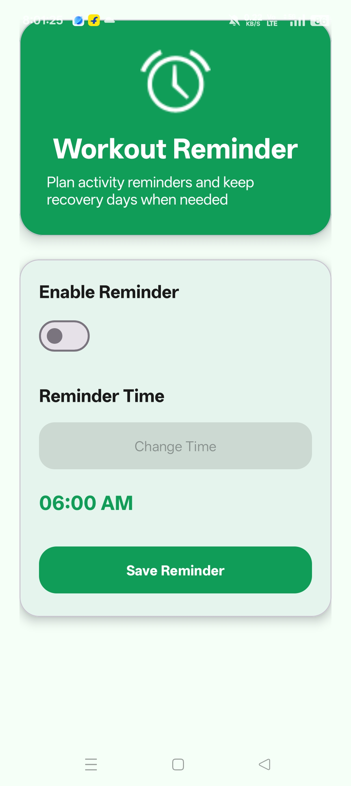
</p>

<details>
<summary><strong>View more screenshots</strong></summary>

<p align="center">
  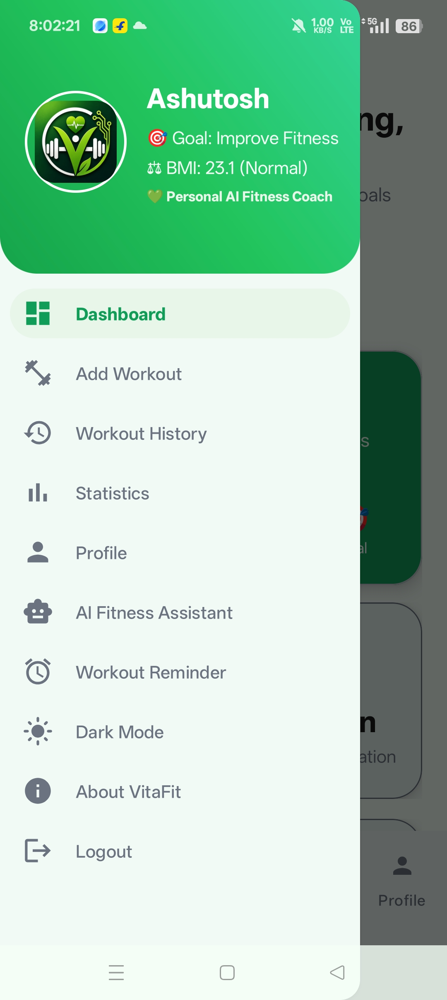
  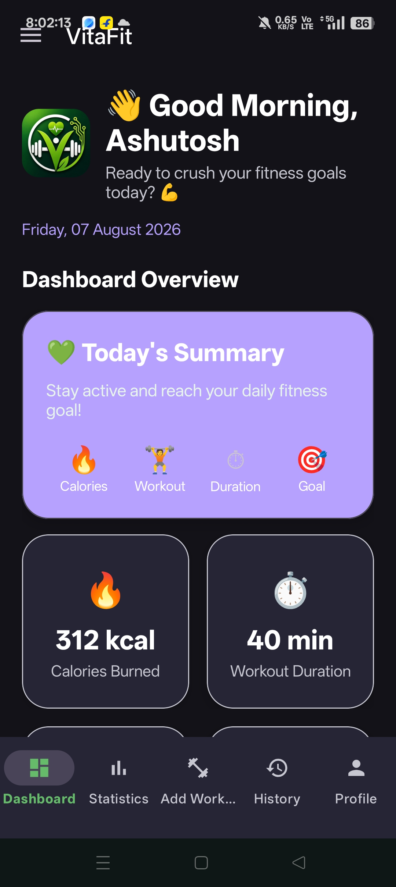
  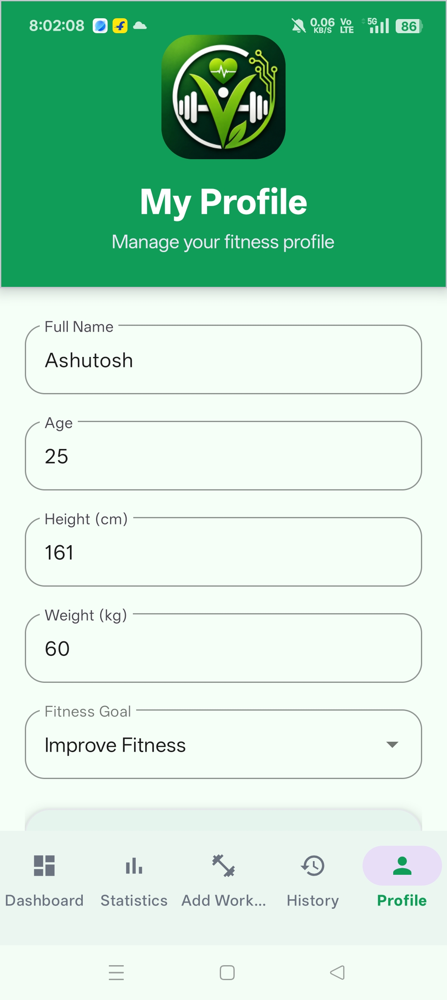
</p>

<p align="center">
  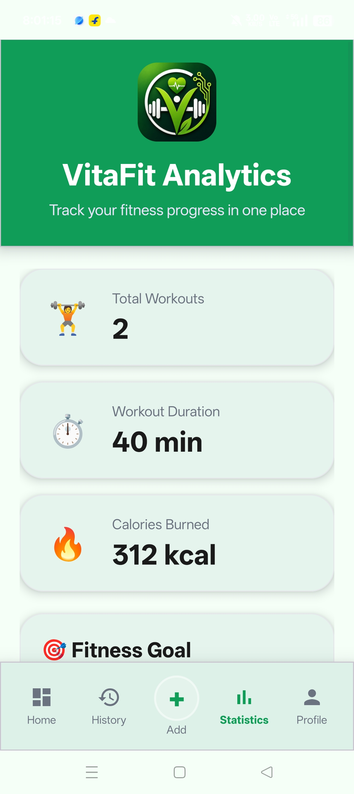
  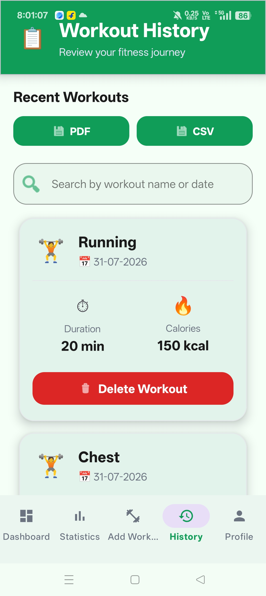
  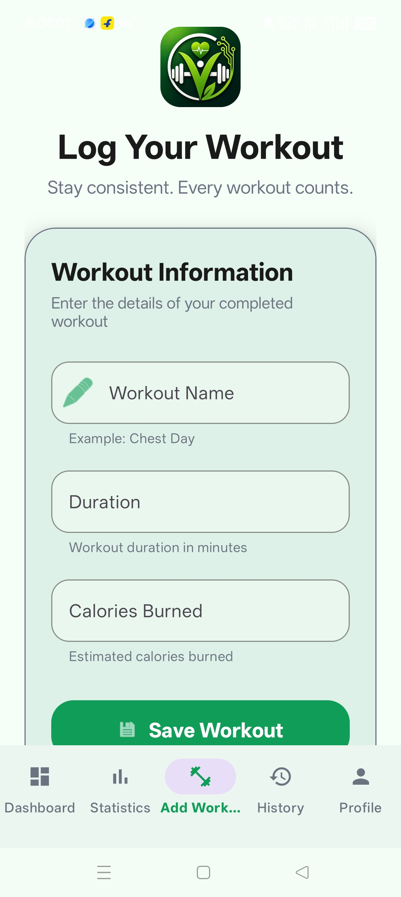
</p>

</details>

## ⚙️ Requirements

- Android Studio
- JDK 17
- Android device or emulator running **Android 7.0 (API 24) or later**
- A Firebase project
- Internet connection for Firebase and AI features

## 🔧 Getting Started

### 1. Clone the repository

```bash
git clone https://github.com/Ashutosh9-pan/VitaFit-AI-Fitness-Tracker.git
cd VitaFit-AI-Fitness-Tracker
```

### 2. Open in Android Studio

Open the cloned project in Android Studio and allow Gradle to sync.

### 3. Configure Firebase

Create or select a Firebase project and register an Android app with the package name:

```text
com.ashutosh.codealpha_fitnesstrackerapp
```

Download the Firebase `google-services.json` file and place it inside the local `app/` directory.

Enable the required Firebase services:

- Email/Password Authentication
- Realtime Database
- Firebase AI Logic
- App Check for production builds

### 4. Build and run

Sync the Gradle files, connect an Android device or start an emulator, and run the application from Android Studio.

## 🔒 Security Notes

The repository intentionally excludes sensitive and machine-specific files, including:

- Signing keystores
- Keystore credentials
- `local.properties`
- `google-services.json`
- Generated APK and App Bundle files

**Never commit signing passwords, private keys, debug App Check tokens, API credentials, or other secrets.**

## 📂 Project Structure

```text
VitaFit-AI-Fitness-Tracker/
├── app/
│   └── src/main/
│       ├── java/        # Activities, adapters, Firebase logic, AI integration
│       ├── res/         # Layouts, menus, drawables, themes, and strings
│       └── AndroidManifest.xml
├── screenshots/         # Application screenshots
├── build.gradle.kts
├── settings.gradle.kts
└── README.md
```

## 🎯 What This Project Demonstrates

- Android application development with **Java**
- Firebase Authentication and Realtime Database integration
- Generative AI integration through **Firebase AI Logic**
- Workout data management and progress visualization
- PDF/CSV report generation and sharing
- Reminder scheduling and reboot restoration
- Application security with **Firebase App Check + Play Integrity**
- Responsive Android UI with Material Components

## 👨‍💻 Author

**Ashutosh Panwar**

- GitHub: [@Ashutosh9-pan](https://github.com/Ashutosh9-pan)
- Repository: [VitaFit-AI-Fitness-Tracker](https://github.com/Ashutosh9-pan/VitaFit-AI-Fitness-Tracker)

---

<p align="center">
  <strong>Built with Java • Android • Firebase • Firebase AI Logic 🚀</strong>
</p>
